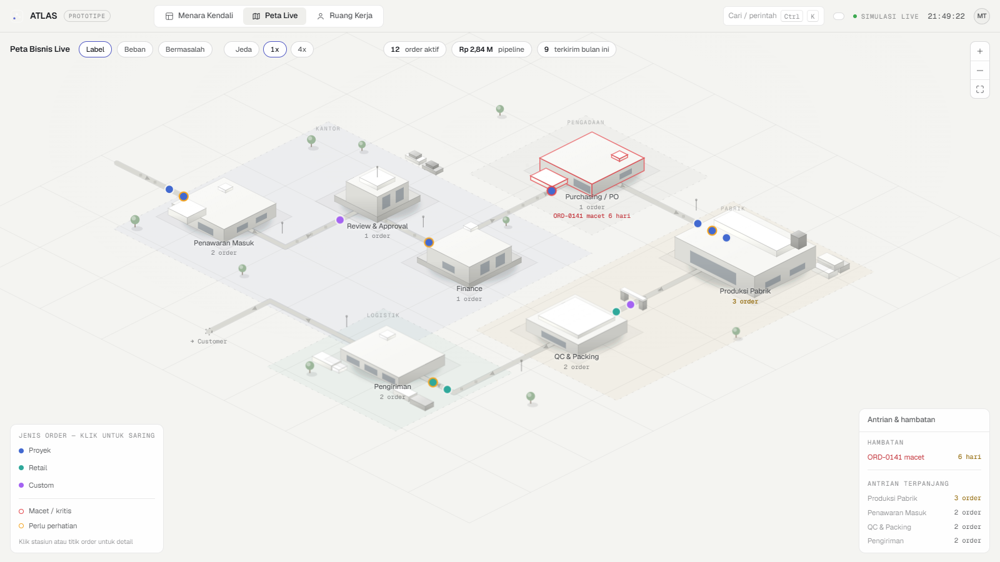
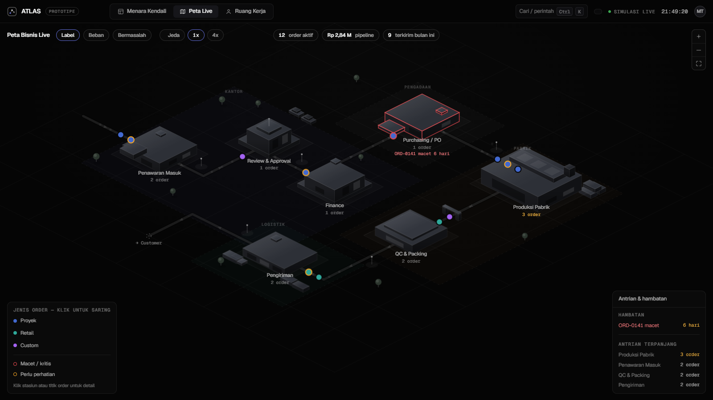
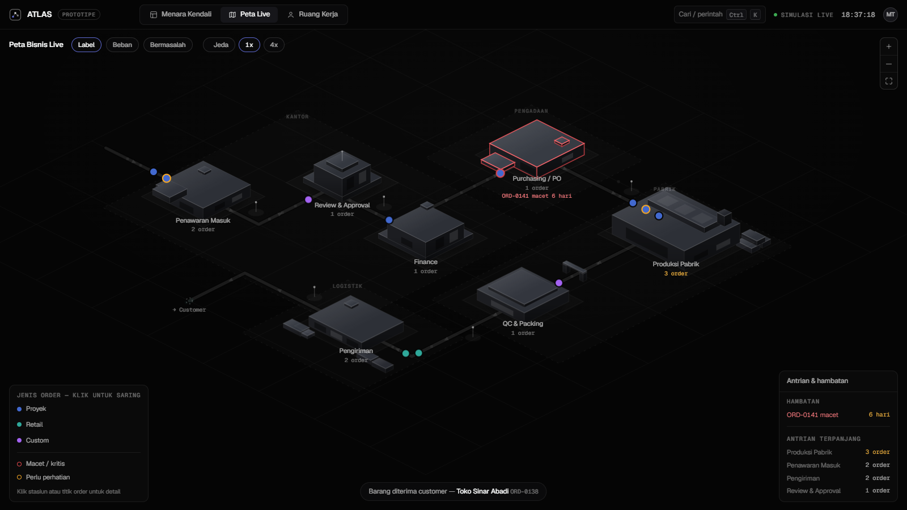
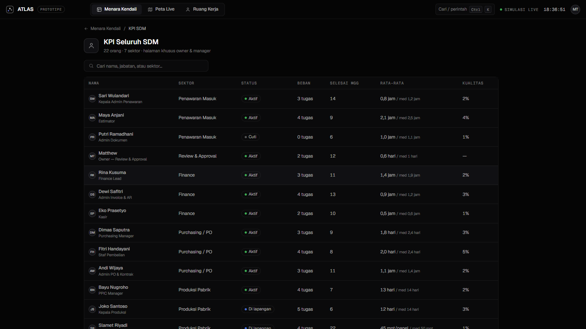
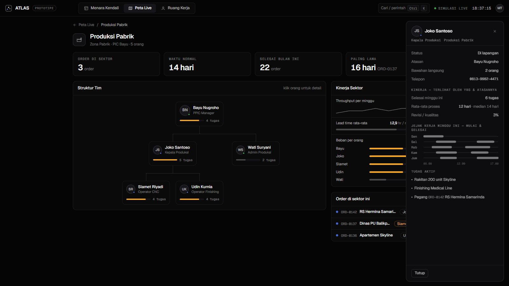
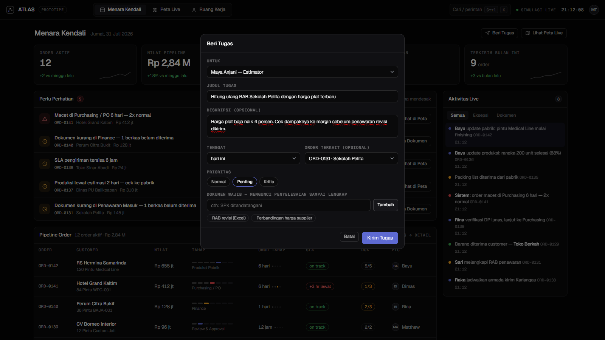
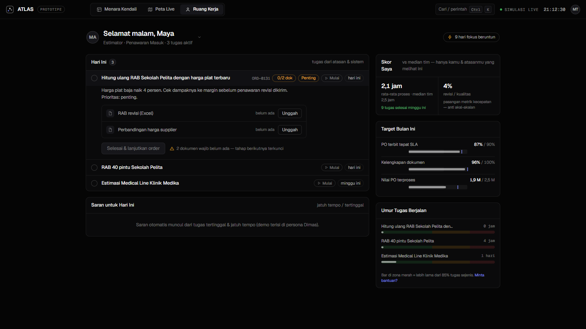

# ATLAS — Ekosistem Kerja Perusahaan (Prototipe)

Prototipe sistem operasi perusahaan: atasan mengirim tugas tanpa WhatsApp,
tiap karyawan punya dashboard sesuai perannya, kinerja terpantau, tidak ada
berkas yang kelewat, dan seluruh alur bisnis terlihat hidup di satu peta
gaya game (eagle eye).

> Status: **prototipe desain** dengan data dummy. Satu file HTML mandiri,
> tanpa backend. Codename "ATLAS" masih placeholder.

## Live demo

**<https://mahewai.github.io/ekosistem-kerja/>**

Terbit otomatis dari `main` lewat GitHub Actions
([`.github/workflows/deploy.yml`](.github/workflows/deploy.yml)) — tidak ada
build step, isi repo langsung disajikan. Setiap push ke `main` menerbitkan ulang
dalam ~1 menit.

> **Satu langkah manual sekali saja, harus oleh pemilik repo.**
> Buka **Settings → Pages → Build and deployment → Source: "GitHub Actions"**.
>
> Workflow tidak bisa menyalakan Pages sendiri: endpoint *create a Pages site*
> butuh hak **admin** repo, dan `GITHUB_TOKEN` tidak punya itu — percobaan
> otomatis gagal dengan `Resource not accessible by integration`. Setelah
> Source disetel, jalankan ulang workflow (**Actions → Deploy ke GitHub Pages →
> Re-run jobs**) dan seterusnya berjalan otomatis.

## Cara membuka

Online: buka tautan di atas. Offline: dobel-klik `index.html` (butuh internet
sekali untuk font Google, selebihnya jalan offline). Pindah layar: tab di atas,
tombol `1 / 2 / 3`, atau `Ctrl+K`.

Jalan di desktop, tablet, dan ponsel. Di layar kecil tab pindah ke bawah, tabel
berubah jadi kartu, dan peta punya navigator stasiun + cubit-untuk-zoom.

## Isi

| Layar | Fungsi |
|---|---|
| **Menara Kendali** | KPI live, antrean "Perlu Perhatian" diranking, tabel pipeline order (stepper 7 tahap, SLA, dokumen, PIC), beban per tahap, kinerja tim, feed aktivitas |
| **Peta Bisnis Live** | Peta isometrik 7 stasiun; order = token yang bergerak dan mengantre; zoom + pan; klik gedung → halaman sektor; filter jenis order & "Bermasalah"; kontrol simulasi Jeda/1x/4x |
| **Halaman Sektor** | Bagan hirarki tim per sektor (PIC → bawahan, 3 tingkat), kinerja sektor (throughput, lead time, beban per orang), order di sektor; klik orang → profil + Jejak Kerja (kapan mulai, kapan selesai) |
| **KPI Seluruh SDM** | Tabel 22 orang lintas 7 sektor + pencarian; klik baris → profil orangnya |
| **Ruang Kerja** | "Hari Ini" + saran (pola My Day), slot dokumen bernama dengan gerbang tahap (tombol lanjut terkunci sampai berkas lengkap), tombol Mulai pencatat jam, skor pribadi vs median tim, multi-persona (lihat dashboard karyawan mana pun) |
| **Beri Tugas** | Owner/manager menugaskan dari Menara atau profil orang: judul, tenggat, prioritas, order terkait, dokumen wajib; tugas mendarat di Ruang Kerja orangnya dengan notifikasi |
| **Alur Proses** | Pita 7 tahap di Menara: nomor, nama, PIC, waktu normal, jumlah order antre; tahap yang macet diberi cincin merah; klik untuk menyaring pipeline. Nomor yang sama muncul di label peta |
| **Tur terpandu** | Tombol "Tur" menjalankan sendiri cerita utamanya dalam ~100 detik: hambatan terlihat → owner menugaskan → karyawan kebentur gerbang dokumen → dokumen lengkap → order jalan lagi. Simulasi dijeda selama tur |

## Tangkapan layar

## Prinsip desain

- Disiplin Linear/Vercel: Geist + Geist Mono, kanvas gelap, elevasi lewat
  langkah terang + hairline, tanpa gradien dekoratif/glassmorphism/glow,
  satu warna aksen.
- Peta mengikuti High-Performance HMI: kalem sampai ada masalah; warna jenuh
  hanya untuk status dan token order. Palet tervalidasi aman buta warna.
- KPI anti-pengawasan: karyawan melihat angkanya sendiri vs median tim
  (bukan ranking rekan); metrik kecepatan selalu berpasangan metrik kualitas.
- Gerak hanya untuk umpan balik dan momen signature (token berjalan, asap
  pabrik saat produksi aktif).

Riwayat keputusan lengkap: [CATATAN.md](CATATAN.md).

## Yang belum nyata (penting sebelum demo ke stakeholder)

Alur penugasan, gerbang dokumen, dan persetujuan benar-benar jalan, tapi ini
masih peraga:

- **Tombol "Unggah" tidak mengunggah file.** Menandai slot dokumen jadi terisi;
  tidak ada file picker maupun penyimpanan.
- **Nama berkas wajib masih dummy.** Daftar per tahap di `STAGES[].docs`
  (mis. Finance: Faktur DP, Bukti transfer DP, Rekap pajak) dikarang untuk
  konteks pabrik pintu — ikut diganti saat flow asli masuk.
- **Tidak ada yang tersimpan.** Refresh = semua tugas, dokumen, persetujuan, dan
  penyelesaian kembali ke awal.
- **Tidak ada login.** Pemilih 22 persona adalah dropdown demo, bukan otentikasi.
- **Order tetap maju sendiri.** Di luar tahap Review, perpindahan tahap
  dijalankan timer simulasi tiap 6,5 detik, bukan oleh aksi orang.

## Menunggu input

1. Flow business process asli (7 stasiun sekarang dummy).
2. Struktur organisasi asli (21 nama di bagan tim fiktif).
3. Nama sistem & perusahaan pemakainya.
