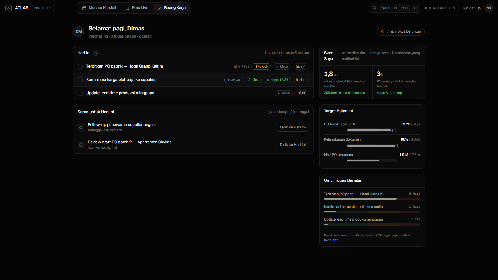

# ATLAS — Ekosistem Kerja Perusahaan (Prototipe)

Prototipe sistem operasi perusahaan: atasan mengirim tugas tanpa WhatsApp,
tiap karyawan punya dashboard sesuai perannya, kinerja terpantau, tidak ada
berkas yang kelewat, dan seluruh alur bisnis terlihat hidup di satu peta
gaya game (eagle eye).

> Status: **prototipe desain** dengan data dummy. Satu file HTML mandiri,
> tanpa backend. Codename "ATLAS" masih placeholder.

## Cara membuka

Dobel-klik `index.html` (butuh internet sekali untuk font Google, selebihnya
jalan offline). Pindah layar: tab di atas, tombol `1 / 2 / 3`, atau `Ctrl+K`.

## Isi

| Layar | Fungsi |
|---|---|
| **Menara Kendali** | KPI live, antrean "Perlu Perhatian" diranking, tabel pipeline order (stepper 7 tahap, SLA, dokumen, PIC), beban per tahap, kinerja tim, feed aktivitas |
| **Peta Bisnis Live** | Peta isometrik 7 stasiun; order = token yang bergerak dan mengantre; zoom + pan; klik gedung → halaman sektor; filter jenis order & "Bermasalah"; kontrol simulasi Jeda/1x/4x |
| **Halaman Sektor** | Bagan hirarki tim per sektor (PIC → bawahan, 3 tingkat), kinerja sektor (throughput, lead time, beban per orang), order di sektor; klik orang → profil + Jejak Kerja (kapan mulai, kapan selesai) |
| **KPI Seluruh SDM** | Tabel 22 orang lintas 7 sektor + pencarian; klik baris → profil orangnya |
| **Ruang Kerja** | "Hari Ini" + saran (pola My Day), slot dokumen bernama dengan gerbang tahap (tombol lanjut terkunci sampai berkas lengkap), tombol Mulai pencatat jam, skor pribadi vs median tim |

## Tangkapan layar

## Prinsip desain

- Disiplin Linear/Vercel: Geist + Geist Mono, kanvas gelap, elevasi lewat
  langkah terang + hairline, tanpa gradien dekoratif/glassmorphism/glow,
  satu warna aksen.
- Peta mengikuti High-Performance HMI: kalem sampai ada masalah; warna jenuh
  hanya untuk status dan token order. Palet tervalidasi aman buta warna.
- KPI anti-pengawasan: karyawan melihat angkanya sendiri vs median tim
  (bukan ranking rekan); metrik kecepatan selalu berpasangan metrik kualitas.
- Gerak hanya untuk umpan balik dan momen signature (token berjalan, asap
  pabrik saat produksi aktif).

Riwayat keputusan lengkap: [CATATAN.md](CATATAN.md).

## Menunggu input

1. Flow business process asli (7 stasiun sekarang dummy).
2. Struktur organisasi asli (21 nama di bagan tim fiktif).
3. Nama sistem & perusahaan pemakainya.
